# Sass vs Jss implementation demo comparison

## The goal
The purpose of this comparison it to help us understand the performance trade-offs of adopting JSS in place of the current Sass implementations in the Alliance codebase.

## The demo
The demo used in this comparison is a stripped down version of a previous implementation of the public user experience (which in turn is a stripped-down version of Alliance homepage). It contains a single page that renders the "resource feed" with the infinite scroll control. The only interractive element is the post fly-out. Reasonable efforts were spent to remove any unused component, store and style code.

#### The Sass version
The demo app created above is also referred to as the "Sass verion" throughout this document. The code resides in the Alliance branch `jss_prototype_compare_noj`

#### The JSS version
The JSS version is created by replacing most of the Sass code with JSS, using the `withTheme` and `withStyles` features from the Material-UI package. This was the approach taken in the Rebel Alliance project. Only a small amount of efforts were spent in trying to modulate these JSS code. These changes are in the `jss_prototype_compare_j` branch.

## Results

### Bundle size
Using the additional features from Material-UI library, plus the JSS code, increased the total javascript package size by ~17kb before compression and ~4kb after.

On the other hand, removing most of the sass files saved about ~80kb before compression and ~13kb after.

Two caveats to notice in this comparison though, is that 1, the JSS implementations were not optimized for size, and 2, the Sass version probably contain some redundant style code as well.

Sass Bundle Size

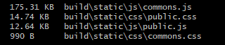

JSS Bundle Size

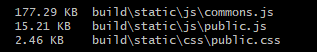

### Lighthouse audit
Lighthouse audits are run on both versions of the app from the local Chrome browser. The "Performance" metric varies each time the audit is run. The numbers are on average close enough that it's hard to call a winner. Running a large number of tests this way is also unlikely to reveal any significant gap. The other metrics are identical.

Sass Audit
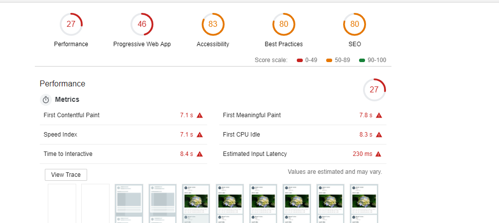

JSS Audit
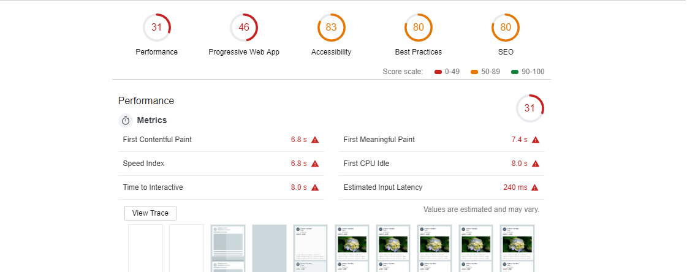

### WebPageTest result
www.webpagetest.org test is run on both versions of the app for 8 times each, configured to simulate access from Toronto with Cable on desktop Chrome. The results varied each times these tests are run. In general, it is hard to point to any significan gap again. 

Sass WebPageTest Summary
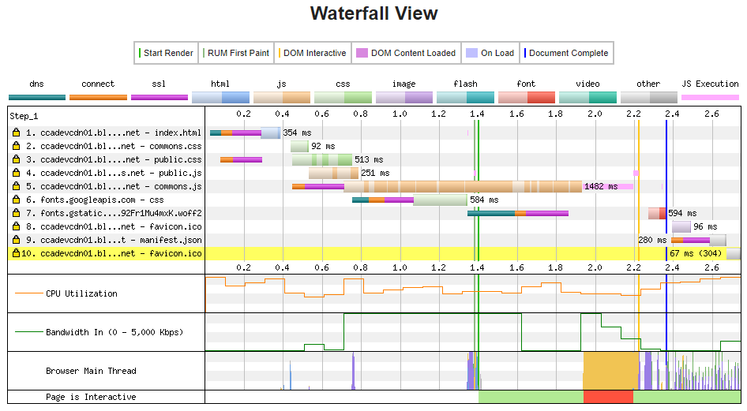

JSS WebPageTest Summary
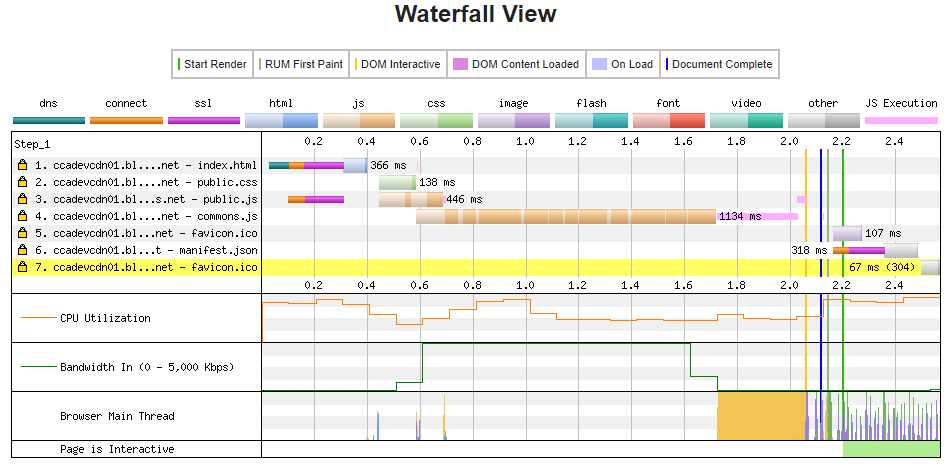

It is worth nothing that the JSS version makes less requests as there are no CSS files to load.

What's even more interesting is the "Start Render" and "Speed Index" metrics offered by this site, which are based on a video-based analysis capturing the moment the page shows any visible change. The JSS version was ~0.8s slower than the Sass version.
//images

The difference seems to come from the early background color change in Sass version, which happened as soong as all the .css file were loaded, whereas it only happened in the JSS version after all .js files were loaded.

[Sass Loading Recording](NJ-FirstRender.mp4)

[JSS Loading Recording](J-FirstRender.mp4)

### Chrome browser job breakdown
The 'Performance' tab in Chrome's developer console offered visual break-downs on the rendering 
timelines of the page. We recorded and compared timelines between the two version for the initial page load and the opening of the post fly-out.

Sass Loading Performance
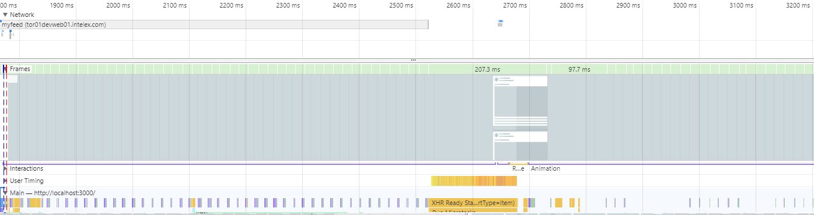

JSS Loading Performance
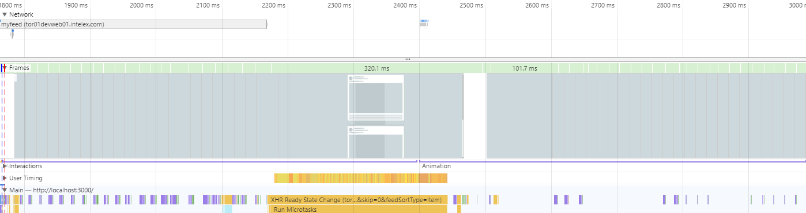

Upon close examination, we see that the browser spends more time in "Recalculate styles" step in general for the JSS version. In the below examples, the JSS version takes about 1-2ms in each recalculation whereas the Sass version general takes < 0.5ms.

Sass Render Performance
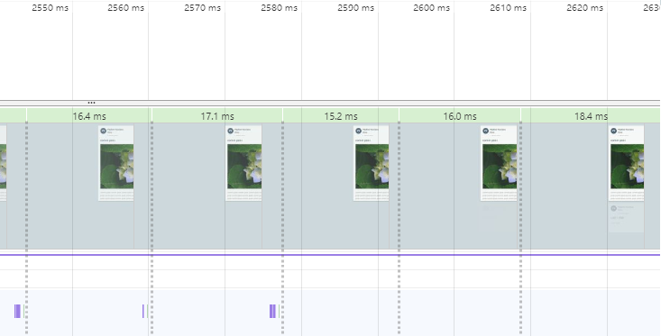

JSS Render Performance
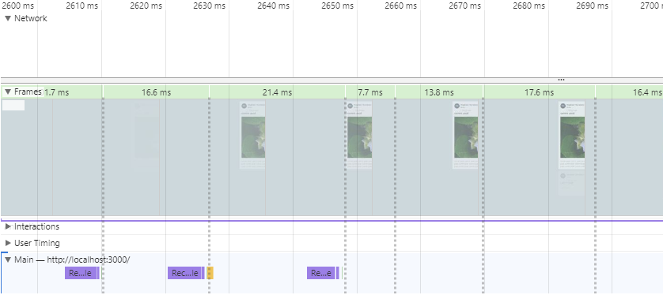

Similar observation can be made when opening and closing the post fly-out. Although the difference in this case is much smaller, as the Sass version taking between 0.32-0.77ms and the JSS version taking between .53-1.56ms.

Sass Post Flyout
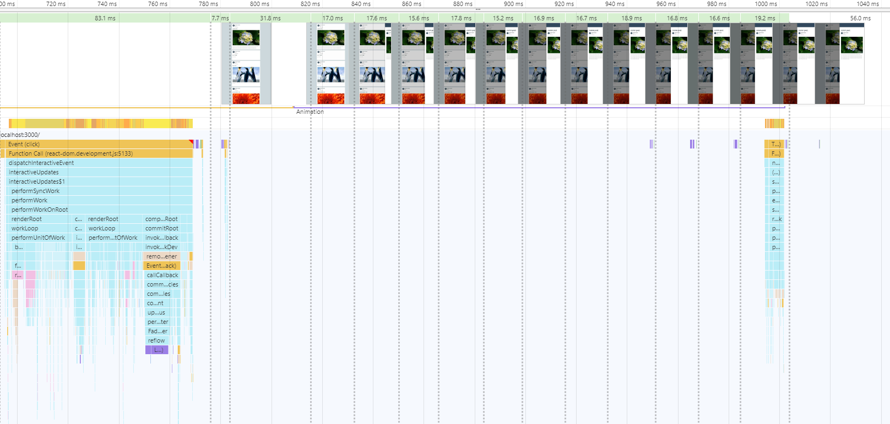

JSS Post Flyout
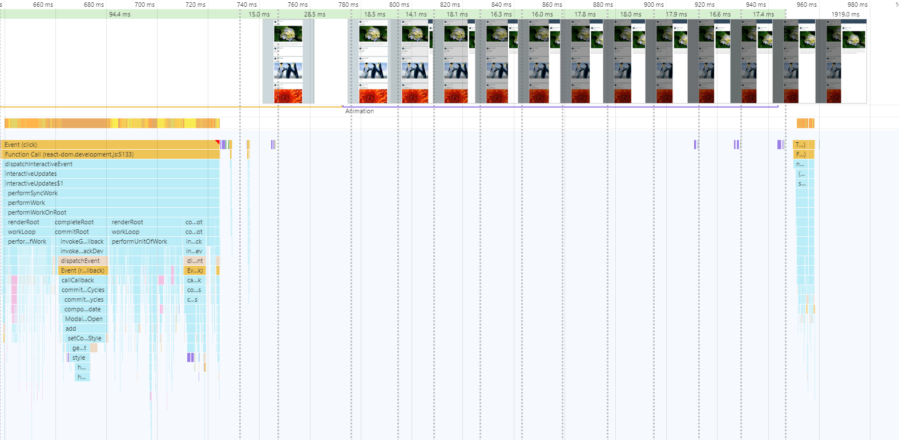

## Analysis
There are some definitive conclusions we can draw from this comparison. Using JSS definitely offers us a chance to remove a couple of requests on page load. And Sass clearly has an advantage in applying global level stylings early.

Other than that, neither implementation shows significant advantages in performance. Using JSS may help reduce overall package size. But that may be because there are a lot of redundant Sass style code in the codebase, and so the savings will be diminishing. The Sass implementation saves some CPU/GPU cycles when recalculating styles. Yet the additional time incurred by JSS, given the complexity of our current pages, are unlikely to eat away much of the 16.7ms budget for key frames.